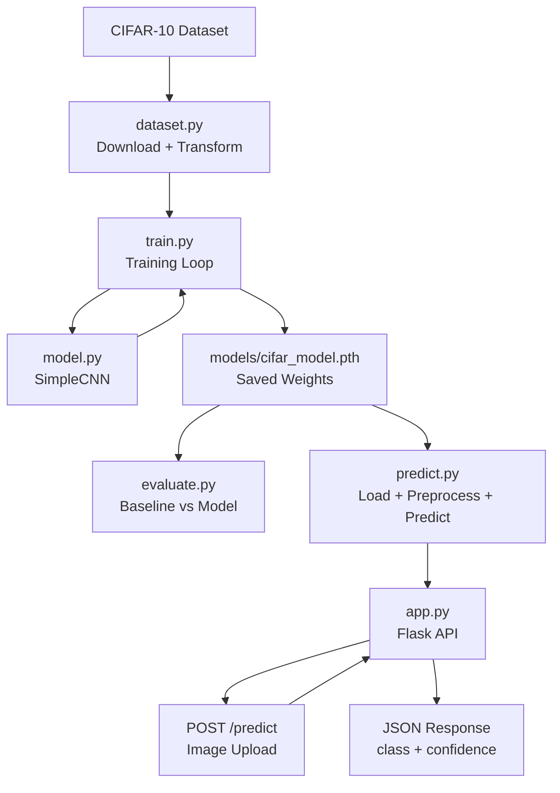

# Project 0 — Architecture Diagram

```mermaid
flowchart TD
    A[CIFAR-10 Dataset] --> B[dataset.py\nDownload + Transform]
    B --> C[train.py\nTraining Loop]
    C --> D[model.py\nSimpleCNN]
    D --> C
    C --> E[models/cifar_model.pth\nSaved Weights]
    E --> F[evaluate.py\nBaseline vs Model]
    E --> G[predict.py\nLoad + Preprocess + Predict]
    G --> H[app.py\nFlask API]
    H --> I[POST /predict\nImage Upload]
    I --> H
    H --> J[JSON Response\nclass + confidence]
```